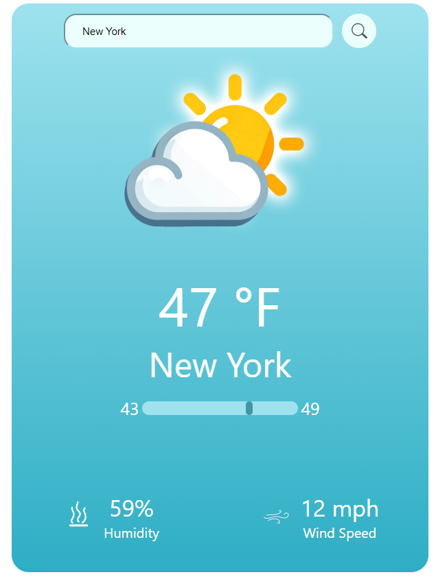
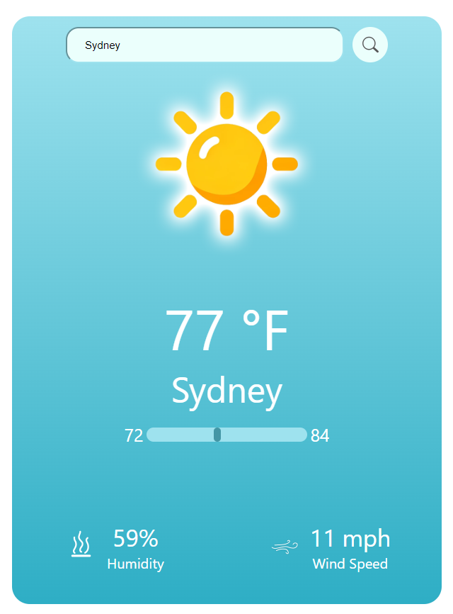
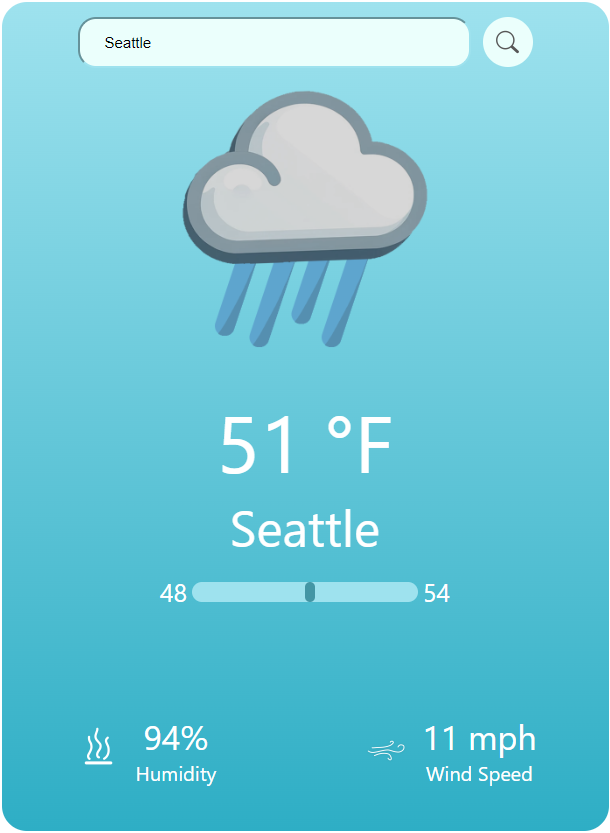
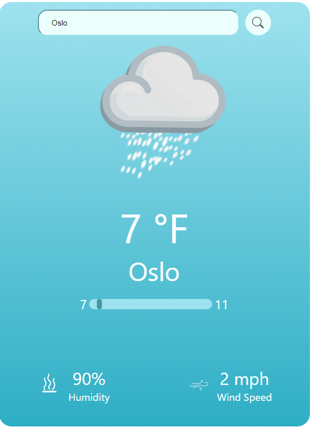

# ReactJS Weather App

React application utilizing realtime weather api to view the sky condition, temperature (low, high, and current) humidity level and wind speed.

    </a> 
    </a> 
    </a> 
   </a> 

Available on <a href="https://tiernandefranco.github.io/react-weather-app/">GitHub Pages</a>.

